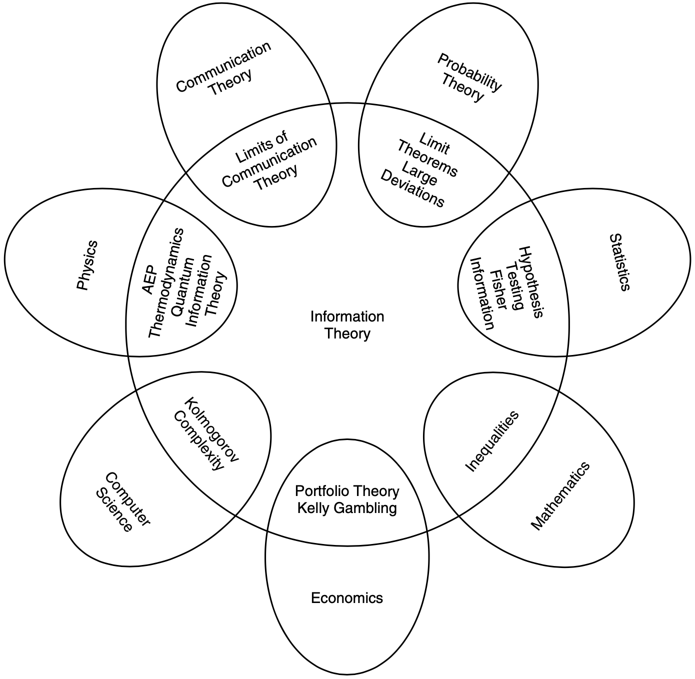

1 Introduction and Preview
*************************************

.. toctree::
   :maxdepth: 2
   
   chapter1-1

Information theory answers two fundamental questions in communication theory:
    - What is the ultimate data compression (answer: the entropy :math:`H`)
    - What is the ultimate transmission rate of communication (answer: the channel capacity :math:`C`)

The figure below illustrates the relationship of information theory to other fields.

